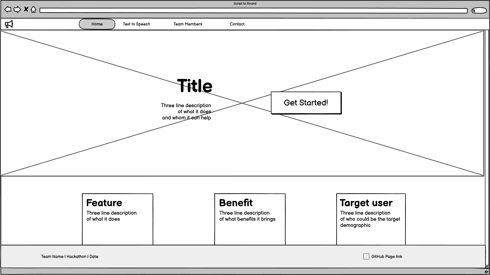
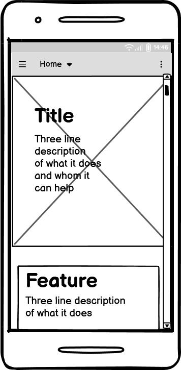
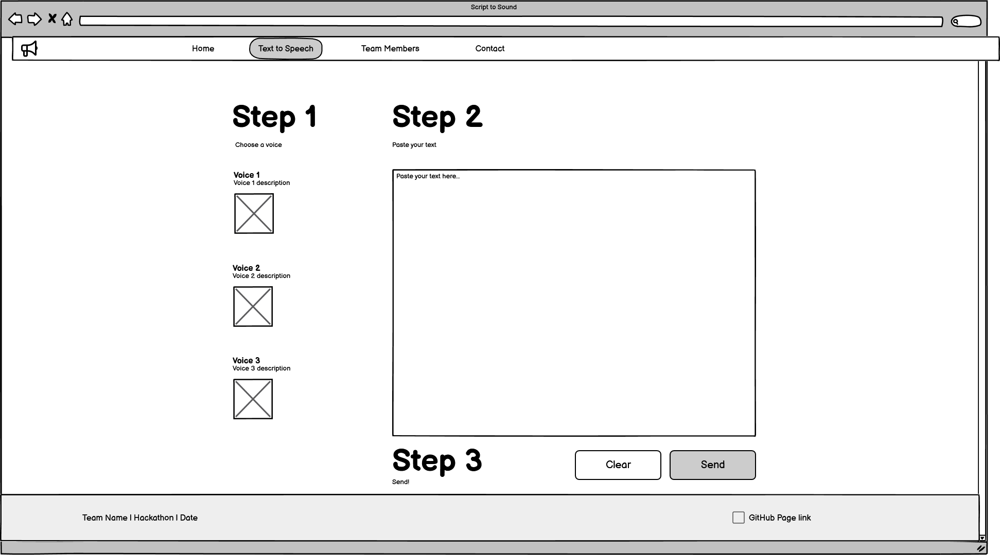
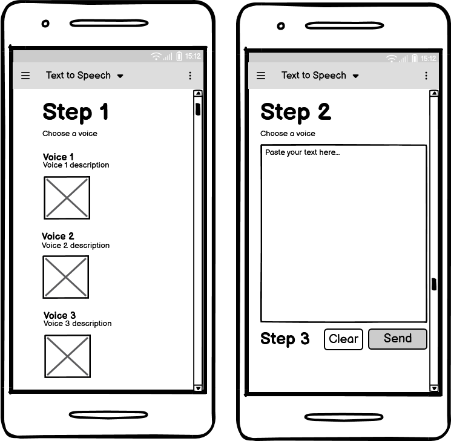
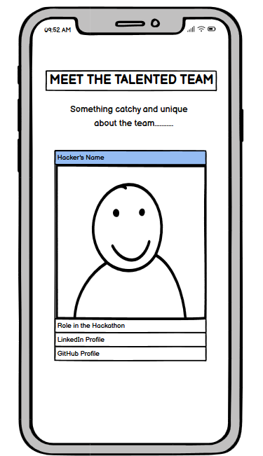
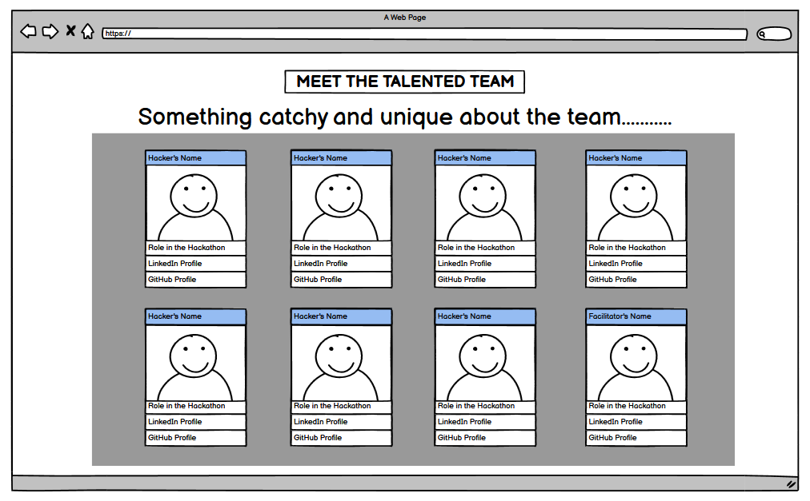
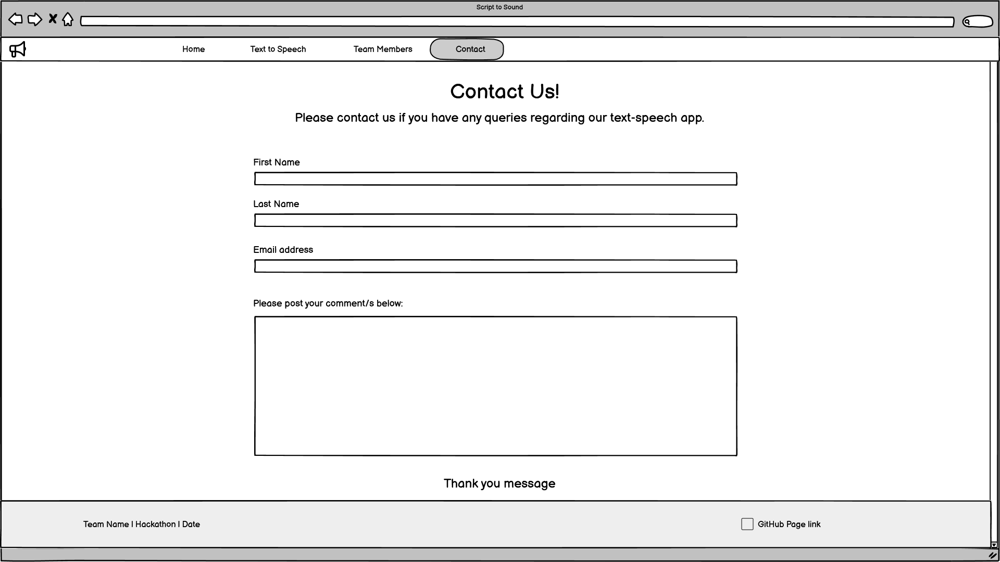
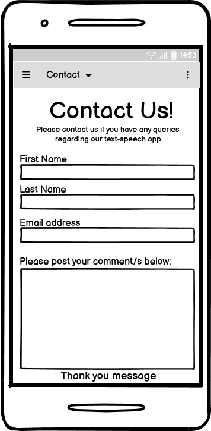

# Script to Sound 🔊 

## Table of contents
1. <a href="#ux-design">UX Design</a> 
2. <a href="#features">Features</a>
3. <a href="#usability">Usability</a>
4. <a href="#technologies-used">Technologies used</a>
5. <a href="#testing">Testing</a>
6. <a href="#bugs">Bugs</a>
7. <a href="#validator-testing">Validator testing</a>
8. <a href="#deployment">Deployment</a>
9. <a href="#credits">Credits</a>
10. <a href="#acknowledgements">Acknowledgements</a>

## UX Design

### Accessibility:

### Feedback Mechanism:

- "sent" messages
- Hover and click effects on buttons and links

### Consistency:

The website maintains a consistent design language throughout all screens, using a cohesive color scheme, typography, and layout. This consistency helps users focus on the content and functions without being distracted by changing interfaces.

#### Color scheme

The chosen color palette, featuring Deep Teal (#004C6D), Mustard Yellow (#FFB700), Soft Cyan (#B2EBF2), and Charcoal (#36454F), is specifically designed to prioritize accessibility and inclusivity. The combination provides high contrast and visual clarity, making it suitable for users with color vision deficiencies, including deuteranopia, protanopia, and tritanopia. Deep Teal and Charcoal serve as strong base colors, while Mustard Yellow and Soft Cyan add brightness and distinguishable accents. This palette ensures that interactive elements, text, and backgrounds remain easily recognizable, even for users with limited color perception, supporting a user-friendly and inclusive interface.

#### Favicon

### Wireframes

- The website layout is highly simple and centralized. Divs with curved edges were chosen to give a lighter mood to the website. Simple design also helps with clarity and navigation. All buttons are accessible with your thumb closer to the bottom of the page, which can be useful for users with large cellphones.

    #### Home page desktop

    

    #### Home page mobile
    

    #### Text-to-Speech page desktop

    

    #### Text-to-Speech page mobile

    

    #### Team page mobile

    

    #### Team page desktop

    

    #### Contact page desktop

     

    #### Contact page mobile

    

## Features

### Home page

The landing page provides a clear introduction to the website and its purpose, ensuring users understand its value right away. It includes:

- Title: A concise and engaging title that captures the essence of the website.
- Landing Image: A visual element that enhances the theme and creates an inviting atmosphere.
- Welcome Message: A brief, welcoming note to guide users and set expectations.
- Three Informational Cards: These cards highlight:
    - The key feature of the website.
    - The benefits it offers to users.
    - The target audience for whom the website is designed.
  
From the moment users land on the page, they will clearly understand:
- What the website is about.
- Why it’s useful.
- How to get started using it.

#### Desktop

#### Mobile

### Team page

The team page introduces the talented individuals behind the project, showcasing each member's contributions and background. It includes:

- Picture/Avatar: A visual representation of each team member.
- Names: The name of each team member for easy identification.
- Main Contributions: A brief summary of the key contributions each team member made to the project.
- Nationality: Information about each team member’s nationality, adding a personal touch.
- Brief Description: A short bio or background highlighting relevant skills or experience.
- GitHub Icon: A clickable icon linking directly to each team member’s GitHub profile for easy access to their work and projects.

This page provides users with a deeper understanding of the people behind the website and their roles in its development.

#### Desktop

#### Mobile

### Features page

The website offers a simple and intuitive one-page interface designed to provide an accessible and seamless text-to-speech experience. Users can select from three distinct voice options, clearly labeled to highlight differences such as gender or tone, ensuring flexibility and personalization. A single text input field allows users to type or paste their desired text, which is then converted into speech using a robust text-to-speech API. The page features a clean and minimalist design, focusing on functionality and ease of use without unnecessary distractions, making it approachable for users of all skill levels.

#### Desktop

#### Mobile

## Features left to implement

As part of the project's evolution, the following features are being considered to enhance functionality and accessibility:

1. Playback Controls

   - Add options to pause, stop, and replay the generated audio, providing users with greater flexibility in interacting with the speech output.

2. Adjustable Speech Settings

   - Introduce controls for adjusting speech speed and volume, allowing users to personalize their listening experience.

3. Accessibility Enhancements

    - Explore the addition of screen reader compatibility and keyboard navigation to improve accessibility for users with disabilities.

4. Multi-Language Support

    - Investigate expanding text-to-speech capabilities to include multiple languages, making the website more inclusive for a global audience.
  
These features reflect our aspirations to further refine and improve the website's usability in the future.

## Usability

---

## Technologies used

| Technology                               | Use                                                                                          |  
|------------------------------------------|---------------------------------------------------------------------------------------------|  
| HTML                                     | Structure the webpage.                                                                      |  
| CSS                                      | Style and add layout to the project.                                                       |  
| JavaScript                               | Make the website interactive.                                                              |  
| Django                                   | A Python-based web framework used to develop the backend, manage server-side logic, and handle routing. |  
| [Heroku](https://www.heroku.com/)        | Cloud platform used for deploying, managing, and hosting the live version of the website.   |  
| [GitHub](https://github.com/)            | Version control platform used to store the project’s repository, collaborate on code, and manage deployments. |  
| [Assembly API](https://www.assemblyai.com/) | Provides the text-to-speech functionality, converting user-input text into spoken audio seamlessly. |
| [Balsamiq](https://balsamiq.com/)        | Used to create wireframes and design the structure of the website.                          |  
| [Font Awesome](https://fontawesome.com/) | Used for the GitHub icon.                                                                   |  
| [Google Fonts](https://fonts.google.com/) | Research, pair, and add fonts to the project.                                               |  
| [Optimizilla](https://imagecompressor.com/) | Compress images.                                                                            |  
| [WEBP Converter](https://cloudconvert.com/webp-converter) | Convert jpg/png images to webp format.                                                     |  
| [Favicon.io](https://favicon.io/favicon-converter/) | Create favicon files.                                                                      |  
| [Am I Responsive](https://ui.dev/amiresponsive) | View and screenshot the page on different devices.                                          |  

## Testing

|Test                           |Action                     | Expected result                |Outcome|
|-------------------------------|---------------------------|--------------------------------|-------|

### User testing

# Bugs

# Validator testing

### HTML W3C Validator

- No errors or warnings shown.

### CSS W3C Validator

- No errors found.

### JSHint

- No warnings shown.

### Lighthouse

- Lighthouse in devtools indicated a high accessibility score.
- Performance scores varied minimally when analysing  the `mobile` or `desktop` versions.

#### Mobile

#### Desktop

# Deployment to Heroku

 Go to Heroku.com and implement the following steps in this order:
 1. On the home page, click 'New' and in the dropdown, click on 'Create a new app'.
 2. Add app name (This name must be unique, and have all lower case letters. Also use minus/dash signs instead of spaces.)
 3. Select Region (Most likely to be Europe)
 4. Click the button that says 'Create App' and name the app. Follow instructions on the screen.
 5. Click on the Deploy tab near the top of the screen.
 6. Where is says Deployment Method click on Github.
 7. Below that, search for your repo name and add that.
 8. Click connect to the app.

 Before clicking below on enable automatic deployment do the following:
 1. Click on the settings tab
 2. Click on reveal config vars.
 3. Add in your variables from your env. files as the key-value pairs.
 4. Go back and click on the Deploy tab. 
 
 Before the app can be connected, push the following new files below to the repository. Go back in the terminal in your coding environment and add the following:
 1. git status
 2. git add requirements.txt
 3. git commit -m "Add requirements.txt file"
 4. git add a Procfile(web: gunicorn project_root.wsgi:application)
 1. git commit -m "Add Procfile"
 2. git push

 Head back over to Heroku where the Deploy tab is.
 2. Click Deploy Branch. (Should be a main or master branch)
 3. Heroku will receive code from Github and build app with the required packages. Hopefully once done the 'App has successfully been deployed message below' will appear.. 
 4. Once you know deployment is successful then click 'Enable Automatic Deploys'
 5. Click 'View' to launch the new app. 

# Credits

# Acknowledgements
