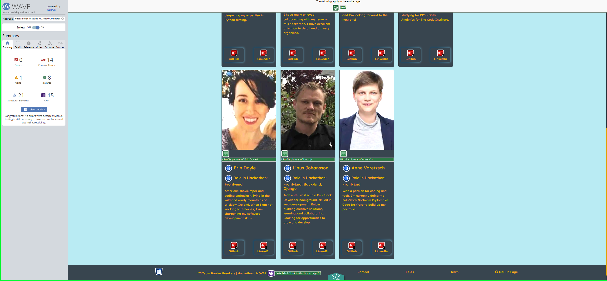
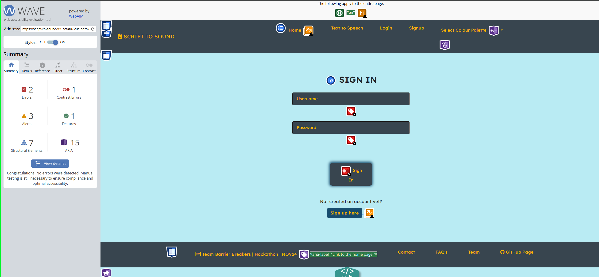
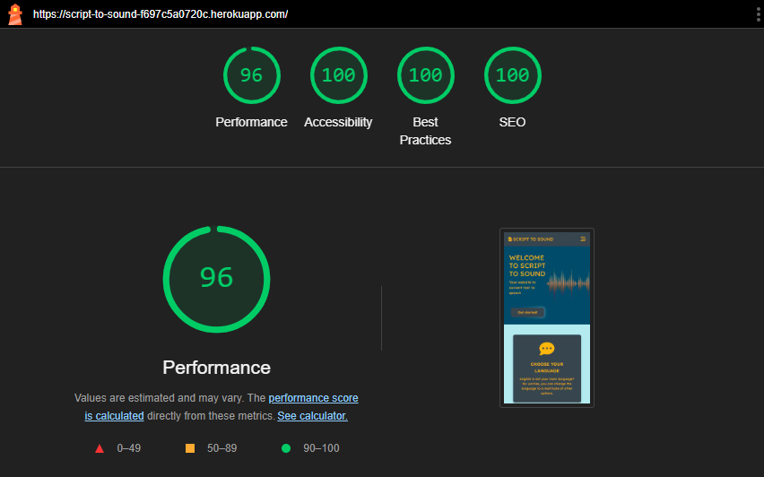
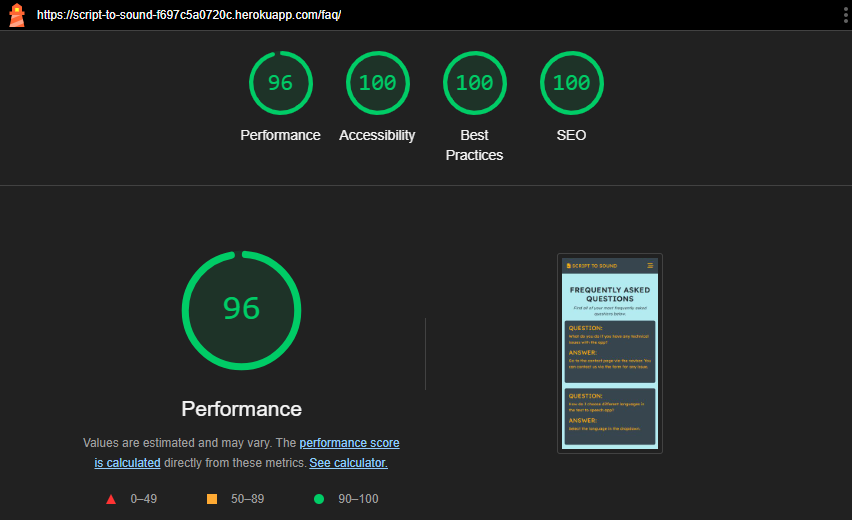

# Script to Sound 🔊 

This website is a project as part of the November 24 Code Insitute Hackathon. It is accessibility themed and the project that was have created is a text to speech app.

Link to live site here: https://script-to-sound-f697c5a0720c.herokuapp.com/


## Table of contents
1. <a href="#ux-design">UX Design</a> 
2. <a href="#features">Features</a>
3. <a href="#usability">Usability</a>
4. <a href="#technologies-used">Technologies used</a>
5. <a href="#testing">Testing</a>
6. <a href="#bugs">Bugs</a>
7. <a href="#validator-testing">Validator testing</a>
8. <a href="#deployment">Deployment</a>
9. <a href="#credits">Credits</a>
10. <a href="#acknowledgements">Acknowledgements</a>

## UX Design

### User Stories

#### **General User Stories**  

1. **As a first-time visitor**, I want to understand the website's purpose immediately, so I can decide whether it meets my needs.  
2. **As a user**, I want to convert my text to speech in a simple and intuitive way, so I can use the tool efficiently.  
3. **As a returning user**, I want to log in and save my preferred language, so I don’t have to set it every time.  
4. **As a user**, I want to select the speech speed and language, so I can customize the audio output according to my needs.  
5. **As a visually impaired user**, I want a high-contrast design and keyboard navigation, so I can use the website comfortably.  

#### **Non-English Speaker User Stories**  

6. **As a non-English speaker**, I want to select from numerous languages, so I can listen to text in my preferred language.  
7. **As a non-English speaker**, I want language options clearly labeled, so I can easily find and select my desired language.  
8. **As a non-English speaker**, I want clear playback controls, so I can pause, replay, or stop the audio when needed.  
9. **As a multilingual user**, I want the ability to switch between languages seamlessly, so I can use the tool in various contexts.  

#### **Team Interaction User Stories**  

10. **As a curious visitor**, I want to see who created the website, so I can understand the team’s background and skills.  
11. **As a potential employer or collaborator**, I want links to team members’ GitHub profiles, so I can explore their work and connect with them.  

#### **Feedback User Stories**  

12. **As a user with questions or feedback**, I want a contact page where I can send a message, so I can get in touch with the team easily.  
13. **As a user**, I want confirmation messages when my input is submitted, so I know my actions were successful.  

#### **Accessibility User Stories**  

14. **As a user with color vision deficiencies**, I want the website to use an accessible color palette, so I can navigate it without confusion.  
15. **As a user with sensitivity to bright screens**, I want a soft-tone palette, so I can interact with the site without eye strain.  

#### **Mobile User Stories**  

16. **As a mobile user**, I want thumb-friendly buttons, so I can interact with the site easily on my phone.  
17. **As a user on a mobile device**, I want the design to be responsive, so it adjusts perfectly to my screen size.  

#### **Playback Controls User Stories**  

18. **As a user**, I want playback controls to replay the generated speech, so I can review the audio without re-entering text.  
19. **As a user**, I want the ability to pause and resume speech, so I can control the audio playback according to my pace.  

#### **Future Multilingual Features User Stories**  

20. **As a multilingual user**, I want pronunciation guides or phonetic hints for certain languages, so I can better understand the speech output.  
21. **As a user**, I want language settings to include regional accents or dialects, so the output sounds more natural for my context.  

## Accessibility  

This project prioritizes accessibility, implementing features that ensure inclusivity for users with diverse needs:  

- **High Contrast Design:** A carefully chosen default color palette provides sufficient contrast for readability.  
- **Accessible Color Schemes:** Alternatives include palettes for color vision deficiencies (e.g., red-green and blue-yellow blindness), grayscale for monochromatic vision, and soft tones for light sensitivity.  
- **Keyboard Navigation:** Users can navigate the interface entirely through keyboard controls.  
- **Responsive Design:** The website adjusts seamlessly to various devices, ensuring usability across screen sizes.  

---

## Feedback Mechanism  

### General Feedback  

- **"Sent" Messages:** Confirms successful actions, such as submitting a form or sending feedback.  
- **Hover and Click Effects:** Highlights buttons and links when interacted with to indicate functionality.  
- **Loading Indicators:** Displays spinners during speech generation or form submissions to indicate ongoing processes.  
- **Active State Indicators:** Clearly shows selected languages and speech speed on the text-to-speech page.  

### Error Recovery and Validation  

- **Custom 404 Page:** Directs users to a recovery page with a link back to the home page when encountering broken or non-existent links.  
- **Invalid Login Feedback:** Displays the error message *"The username and/or password you specified are not correct"* when login details are incorrect.  

---

## Consistency  

### Design Language  

The project employs a cohesive design language, maintaining consistency in:  

- **Color Palette:** A default scheme featuring Deep Teal, Mustard Yellow, Soft Cyan, and Charcoal.  
- **Typography:** Uniform text styles for readability and professionalism.  
- **Layout:** Structured navigation across all pages.  

### Branding  

#### Favicon  

The favicon reflects the project's core functionality, combining a document and speaker icon in a minimalist style with high contrast to align with accessibility goals.  

  

## Visual Accessibility  

Multiple accessible palettes were tested and optimized to meet Web Content Accessibility Guidelines (WCAG):  

1. **High Contrast Palette**  
2. **Red-Green Color Blindness Palette**  
3. **Blue-Yellow Color Blindness Palette**  
4. **Grayscale Palette**  
5. **Soft Tones Palette**  

---

### Default Color scheme


The chosen color palette, featuring Deep Teal (#004C6D), Mustard Yellow (#FFB700), Soft Cyan (#B2EBF2), and Charcoal (#36454F), is specifically designed to prioritize accessibility and inclusivity. The combination provides high contrast and visual clarity, making it suitable for users with color vision deficiencies, including deuteranopia, protanopia, and tritanopia. Deep Teal and Charcoal serve as strong base colors, while Mustard Yellow and Soft Cyan add brightness and distinguishable accents. This palette ensures that interactive elements, text, and backgrounds remain easily recognizable, even for users with limited color perception, supporting a user-friendly and inclusive interface.

### Accessible Color Palette Choices

The color palettes chosen for this project were carefully crafted to ensure inclusivity and usability for individuals with diverse visual impairments. These palettes address common challenges faced by users with color blindness, low vision, and light sensitivity. Each palette emphasizes high contrast and distinguishable hues to meet Web Content Accessibility Guidelines (WCAG) standards and provide a positive experience for all users.

For users with red-green color blindness (Protanopia and Deuteranopia), Palette 2 substitutes colors prone to confusion (reds and greens) with blue and yellow tones, which are easier to differentiate. Palette 3 is optimized for blue-yellow color blindness (Tritanopia), emphasizing clear distinctions between red and blue hues. Palette 4, a grayscale option, caters to those with severe color blindness or monochromacy, ensuring clarity solely through luminance contrasts. Lastly, Palette 5 features soft, non-intrusive tones ideal for users with light sensitivity, reducing eye strain while maintaining readability and visual appeal.

These palettes were tested for accessibility using tools like the WebAIM Contrast Checker and Color Oracle, ensuring compliance with WCAG standards. By incorporating these accessible color schemes, this project aims to create an inclusive digital environment that prioritizes user experience for all audiences.

#### High Contrast


#### Red Green Colour Blindness


#### Blue Yellow Colour Blindness


#### Grayscale


#### Soft Tones


---

### Wireframes

- The website layout is highly simple and centralized. Divs with curved edges were chosen to give a lighter mood to the website. Simple design also helps with clarity and navigation. All buttons are accessible with your thumb closer to the bottom of the page, which can be useful for users with large cellphones.

    #### Home page desktop

    

    #### Home page mobile
    

    #### Text-to-Speech page desktop

    

    #### Text-to-Speech page mobile

    

    #### Team page mobile

    

    #### Team page desktop

    

    #### Contact page desktop

     

    #### Contact page mobile

    

## Features

### Home page

The landing page provides a clear introduction to the website and its purpose, ensuring users understand its value right away. It includes:

- Title: A concise and engaging title that captures the essence of the website.
- Landing Image: A visual element that enhances the theme and creates an inviting atmosphere.
- Welcome Message: A brief, welcoming note to guide users and set expectations.
- Three Informational Cards: These cards highlight:
    - The key feature of the website.
    - The benefits it offers to users.
    - The target audience for whom the website is designed.
  
From the moment users land on the page, they will clearly understand:
- What the website is about.
- Why it’s useful.
- How to get started using it.


#### Desktop


#### Mobile


### Team page

The team page introduces the talented individuals behind the project, showcasing each member's contributions and background. It includes:

- Picture/Avatar: A visual representation of each team member.
- Names: The name of each team member for easy identification.
- Main Contributions: A brief summary of the key contributions each team member made to the project.
- Nationality: Information about each team member’s nationality, adding a personal touch.
- Brief Description: A short bio or background highlighting relevant skills or experience.
- GitHub Icon: A clickable icon linking directly to each team member’s GitHub profile for easy access to their work and projects.

This page provides users with a deeper understanding of the people behind the website and their roles in its development.


#### Desktop


#### Mobile


### Features page

The website offers a simple and intuitive one-page interface designed to provide an accessible and seamless text-to-speech experience. Users can select from three distinct voice options, clearly labeled to highlight differences such as gender or tone, ensuring flexibility and personalization. A single text input field allows users to type or paste their desired text, which is then converted into speech using a robust text-to-speech API. The page features a clean and minimalist design, focusing on functionality and ease of use without unnecessary distractions, making it approachable for users of all skill levels.

#### Desktop


#### Mobile


## Agile in the Project

Agile methodology played a vital role in the development of this project, fostering collaboration, adaptability, and iterative progress. The team embraced Agile principles to break down tasks, prioritize work, and deliver increments of value throughout the hackathon.

### Using GitHub for Agile Workflow
  
The team utilized GitHub Issues as the core tool for task management and collaboration. Tasks were categorized and prioritized using must-have and should-have labels, ensuring the most critical features and fixes were addressed first. Each issue included clear descriptions, labels, and milestones to maintain focus and organization, and tasks were assigned to individual team members or multiple contributors when collaboration was necessary.

Below are examples of GitHub Issues used during the project:


- Screenshot of open issues, showing the features and fixes to be completed during the hackathon.


- Screenshot of resolved issues, showing the features and fixes completed during the hackathon.

### Challenges and Solutions

While Agile practices enabled efficient task tracking and prioritization, the team faced challenges with merging changes across different forks. These conflicts required constant communication and careful coordination to resolve. The team approached this by setting aside dedicated time for merge conflict resolution and regularly syncing branches to minimize future issues.

### Sprint Workflow
The team worked in focused sprints to deliver features and tackle bugs iteratively. Regular stand-ups ensured everyone remained aligned, and sprint reviews allowed for quick assessment of completed tasks and adjustments to upcoming priorities. This sprint-based workflow provided structure while accommodating the fast-paced nature of the hackathon.

By adhering to Agile practices, the team successfully navigated challenges, stayed organized, and delivered a robust project within the hackathon's constraints.

---

## Technologies Used  

| Technology                               | Use                                                                                                           |
|------------------------------------------|---------------------------------------------------------------------------------------------------------------|
| HTML                                     | Structure the webpage.                                                                                        |
| CSS                                      | Style and add layout to the project.                                                                          |
| JavaScript                               | Make the website interactive.                                                                                 |
| Django                                   | A Python-based web framework used to develop the backend, manage server-side logic, and handle routing.       |
| [Heroku](https://www.heroku.com/)        | Cloud platform used for deploying, managing, and hosting the live version of the website.                     |
| [GitHub](https://github.com/)            | Version control platform used to store the project’s repository, collaborate on code, and manage deployments. |  
| [gTTS](https://pypi.org/project/gTTS/)   | Provides the text-to-speech functionality, converting user-input text into spoken audio seamlessly.           |  
| [ChatGPT](https://openai.com/chatgpt)    | Used for generating code snippets, improving documentation, and brainstorming project ideas.                  |  
| [GitHub Copilot](https://github.com/features/copilot) | AI-powered code assistant used to write and optimize code faster.                                |  
| [Balsamiq](https://balsamiq.com/)        | Used to create wireframes and design the structure of the website.                                            |  
| [Font Awesome](https://fontawesome.com/) | Used for the GitHub icon.                                                                                     |
| [The Noun Project](https://thenounproject.com/) | Used to create image for favicon.                                                                      |
| [Google Fonts](https://fonts.google.com/) | Research, pair, and add fonts to the project.                                                                |
| [Optimizilla](https://imagecompressor.com/) | Compress images.                                                                                           |
| [WEBP Converter](https://cloudconvert.com/webp-converter) | Convert jpg/png images to webp format.                                                       |
| [Favicon.io](https://favicon.io/favicon-converter/) | Create favicon files.                                                                              |
| [Am I Responsive](https://ui.dev/amiresponsive) | View and screenshot the page on different devices.                                                     |
| [Canva](https://www.canva.com/)          | Creating landing, header, and icon images.                                                                    |


## Testing

### Core Functional Features

| Test                                          | Action                                           | Expected Result                                                     | Outcome |
|-----------------------------------------------|--------------------------------------------------|---------------------------------------------------------------------|---------|
| User can select a desired language            | Open the text-to-speech tool and select a language from the dropdown | The selected language is applied to the text-to-speech functionality | Pass    |
| User can adjust speech speed                  | Change the speech speed slider                  | Speech plays at the chosen speed                                   | Pass    |
| Preferred language is saved after login       | Log in and set a preferred language             | Preferred language is saved and applied automatically on the next login | Pass    |
| New user can sign up                          | Fill out the sign-up form and submit            | User account is successfully created                               | Pass    |
| Registered user can log in                    | Enter valid credentials and log in              | User is redirected to their account with personalized settings     | Pass    |
| Team Members page loads correctly             | Navigate to the Team Members page               | Page displays information about all team members                   | Pass    |
| Contact page form sends a message             | Fill out the contact form and click "Submit"    | Message is sent, and a confirmation notification is displayed      | Pass    |
| Incorrect login details display error message | Attempt to log in with invalid credentials      | An error message appears prompting the user to check their details | Pass    |
| Password validation in sign-up form           | Enter a password that does not meet criteria    | Form displays a password validation error                          | Pass    |

---

### Responsiveness and Compatibility

| Test                                          | Action                                            | Expected Result                                                    | Outcome |
|-----------------------------------------------|---------------------------------------------------|--------------------------------------------------------------------|---------|
| Responsiveness on different resolutions       | Use DevTools to check pages on various screen sizes | All pages maintain a consistent, readable layout                 | Pass    |
| Mobile responsiveness                         | Test layout and functionality on mobile devices   | Content adjusts to fit smaller screens without losing usability    | Pass    |
| Browser compatibility                         | Open the site in Chrome, Firefox, and Edge        | The site functions and displays consistently in all browsers       | Pass    |
| Touch navigation on mobile devices            | Use touch gestures on mobile                      | Buttons and dropdowns respond correctly to touch input             | Pass    |

---

### Accessibility and Usability

| Test                                          | Action                                            | Expected Result                                                     | Outcome |
|-----------------------------------------------|--------------------------------------------------|---------------------------------------------------------------------|---------|
| Text-to-speech tool works on all pages        | Use the tool on multiple pages                  | Text is read aloud correctly regardless of the page                | Pass    |
| Language dropdown options are accessible      | Use a keyboard to navigate the dropdown         | Dropdown is fully navigable and selectable via keyboard            | Pass    |
| Contact form validates required fields        | Submit the form with empty required fields      | Validation errors display for all missing required fields          | Pass    |
| Keyboard navigation across elements           | Use keyboard to navigate through all interactive elements | Tabbing navigates logically and interactively across all elements  | Pass    |
| Dropdown accessibility                        | Open and select options from dropdown menus using keyboard | Dropdown can be fully navigated and options selected via keyboard  | Pass    |
| High contrast mode usability                  | Enable high contrast mode on the operating system | All text and buttons remain visible and accessible                 | Pass    |
| Screen reader functionality                   | Use a screen reader to navigate the app         | Screen reader reads all interactive elements and text correctly    | Pass    |
| Error message clarity                         | Trigger error messages (e.g., invalid login or form submission) | Error messages clearly explain the issue and how to fix it         | Pass    |
| Large text mode usability                     | Enable large text mode in browser settings      | Content scales appropriately without breaking the layout           | Pass    |


### WebAIM

To ensure the accessibility of the chosen color palettes, testing was conducted using tools like [WebAIM Contrast Checker](https://webaim.org/resources/contrastchecker/bookmarklet). The WebAIM Contrast Checker is an essential resource for verifying color contrast ratios against the Web Content Accessibility Guidelines (WCAG). By inputting text and background colors into the tool, we confirmed that all palettes meet or exceed the minimum required contrast ratios for normal and large text. This process ensures that users with low vision or other visual impairments can read content comfortably without straining their eyes.

### Wave Accessibility screenshots

### Home Page

### Text To Speech Page

### Contact Page

### FAQ Page

### Team Page

### Sign Up Page

### Sign In Page


### Color Oracle

Additionally, [Color Oracle](https://colororacle.org/) was used to simulate different types of color blindness, including Protanopia, Deuteranopia, and Tritanopia. This helped identify potential issues in color differentiation and adjust hues for optimal visibility. The tool’s real-time simulation ensures that the palettes are accessible and usable across all forms of color blindness. Combining these testing tools ensures that the color palettes chosen for the project not only comply with accessibility standards but also provide a practical and inclusive user experience.


# Validator testing

### HTML W3C Validator

- Except for the **"Text to Speech"** page, all pages passed the W3C HTML Validation with no errors.
- 
  - No errors or warnings shown.

- The errors encountered in the **"Text to Speech"** page are due to how **Django** formats its `form` element, creating what the validator interprets as trailing tags.
  - 
-  The opening and closing tags are there and working as expected.
  -  


|Page           |Validation Result              |
|---------------|-------------------------------|
|Home           | No errors or warnings to show |
|Text to Speech | 6 Errors                      |
|Login          | No errors or warnings to show |
|Logout         | No errors or warnings to show |
|Profile        | No errors or warnings to show |
|Sign up        | No errors or warnings to show |
|Contact        | No errors or warnings to show |
|FAQ            | No errors or warnings to show |
|Team           | No errors or warnings to show |
### CSS W3C Validator


- No errors found.

### JSHint

- No warnings shown.


### Lighthouse

- Lighthouse in devtools indicated a high accessibility score.
- Performance scores varied minimally when analysing  the `mobile` or `desktop` versions.

#### Home Page - Mobile



#### Home Page - Desktop


#### Text to Speech Page - Mobile


#### Text to Speech Page - Desktop


#### Contact Page - Mobile


#### Contact Page - Desktop


#### FAQ Page - Mobile



#### FAQ Page - Desktop


#### Teams Page - Mobile


#### Teams Page - Desktop


#### Signup Page - Mobile


#### Signup Page - Desktop


#### Sign in Page - Mobile


#### Sign in Page - Desktop


#### Profile Page - Mobile


#### Profile Page - Desktop


#### Sign out Page - Mobile


#### Sign out Page - Desktop


# Deployment to Heroku

 Go to Heroku.com and implement the following steps in this order:
 1. On the home page, click 'New' and in the dropdown, click on 'Create a new app'.
 2. Add app name (This name must be unique, and have all lower case letters. Also use minus/dash signs instead of spaces.)
 3. Select Region (Most likely to be Europe)
 4. Click the button that says 'Create App' and name the app. Follow instructions on the screen.
 5. Click on the Deploy tab near the top of the screen.
 6. Where is says Deployment Method click on Github.
 7. Below that, search for your repo name and add that.
 8. Click connect to the app.

 Before clicking below on enable automatic deployment do the following:
 1. Click on the settings tab
 2. Click on reveal config vars.
 3. Add in your variables from your env. files as the key-value pairs.
 4. Go back and click on the Deploy tab. 
 
 Before the app can be connected, push the following new files below to the repository. Go back in the terminal in your coding environment and add the following:
 1. git status
 2. git add requirements.txt
 3. git commit -m "Add requirements.txt file"
 4. git add a Procfile(web: gunicorn project_root.wsgi:application)
 1. git commit -m "Add Procfile"
 2. git push

 Head back over to Heroku where the Deploy tab is.
 1. Click Deploy Branch. (Should be a main or master branch)
 2. Heroku will receive code from Github and build app with the required packages. Hopefully once done the 'App has successfully been deployed message below' will appear.. 
 3. Once you know deployment is successful then click 'Enable Automatic Deploys'
 4. Click 'View' to launch the new app. 
 5. Link to deployed site is: https://script-to-sound-f697c5a0720c.herokuapp.com/

---

[](https://gitpod.io/#https://github.com/hannahro15/Nov24Hackathon)

## 🚀 Project Setup

### 1. Clone the Repository
```bash
git clone https://github.com/hannahro15/Nov24Hackathon.git
cd Nov24Hackathon
```

### 2. Setup Environment Variables
Create a `.env` file in the root directory with the following content:

**.env**
```bash
SECRET_KEY=<your_secret_key>
DEV=1  # Debug mode enabled, remove this line for production
DATABASE_URL=<your_database_url>
```

- **SECRET_KEY**: Replace `<your_secret_key>` with a secure key (e.g., you can generate one using Django).
- **DATABASE_URL**: Provide the URL for your database (e.g., PostgreSQL, SQLite).

### 3. Install Dependencies
```bash
pip install -r requirements.txt
```

### 4. Run Database Migrations
```bash
python manage.py migrate
```

### 5. Start the Development Server
```bash
python manage.py runserver
```

### 🌐 Access the Project
Open your browser and navigate to: [http://localhost:8000](http://localhost:8000)

### 🛠️ Additional Tips
- To deactivate debug mode, remove `DEV=1` from your `.env` file.
- For production, ensure your `.env` file is secure and never commit it to source control.


# Credits
- Favicon created by Argentinian designer [Jessica Gueller](https://thenounproject.com/creator/jessi.guell)

# Acknowledgements

We would like to recognize the contributions of our team members, whose efforts made this hackathon project possible. Each person brought unique skills and played a vital role in completing the project within the time constraints.

- Tafadzwa Mangena: Contributed to Agile processes and developed the Team Member’s page.
- Hannah Olbrich: Served as Scrum Master, coordinated Agile practices, and created the Contact and FAQ and FAQ pagess.
- Arthur Vilela: Worked on front-end development, testing, and documentation to ensure the project was user-friendly and well-supported.
- Ed Radcliffe: Played a dual role in front-end and back-end development, contributing to the technical functionality of the project.
- Erin Doyle: Focused on front-end development, improving the design and user interface.
- Linus J: Provided support in both front-end and back-end development, particularly using Django for the back-end framework.
- Anne Voretzsch: Contributed to front-end development, refining the interface and design.

This project was a collaborative effort, and each member’s contributions were integral to its completion. Thank you to everyone on the team!